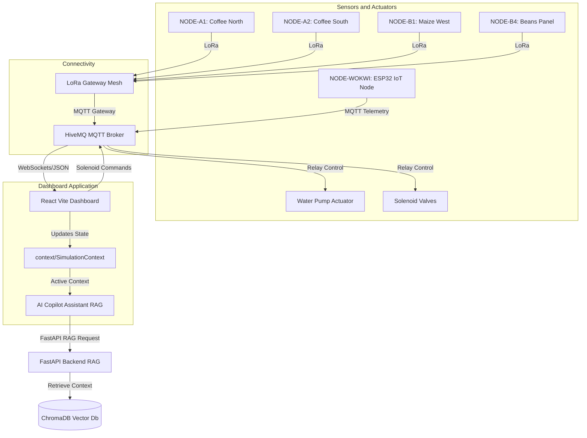

# System Architecture - AgriSense Smart Farming

## Project Overview
AgriSense is an AI-powered, closed-loop telemetry and smart irrigation controller built for the Mbarara pilot project. The project's goal is to optimize soil moisture levels and conserve water resources across multiple plots using automated LoRa-connected sensor nodes and actuator networks.

## Core Problem Statement
Traditional farming in semi-arid zones suffers from either over-irrigation (which depletes local aquifers and jacks up utility billing) or under-irrigation (which stresses crops like Coffee and Maize, reducing yield). AgriSense solves this by implementing:
1. Continuous soil moisture tracking at distinct soil depth levels (20cm, 30cm, 40cm, 60cm).
2. Autonomous closed-loop irrigation triggered dynamically by sensor readings.
3. LoRa-based telemetry aggregation back to an ESP32 gateway.
4. Live 3D Digital Twin visualization to track physical crop plots, solenoid valves, and tank supplies.

## System Topology and Components
The system integrates hardware components with a React-based monitoring dashboard:

## API and Network Protocols
- **MQTT Broker**: `broker.hivemq.com` on port `1883`
- **Telemetry Topic**: `agrisense/node_wokwi/telemetry` which sendsJSON data containing `moisture`, `temperature`, and `humidity`.
- **Actuator Command Topic**: `agrisense/node_wokwi/pump` which accepts `1` (ON) or `0` (OFF).
- **Communication Interval**: Sensors post readings every 5-10 seconds depending on network load.
